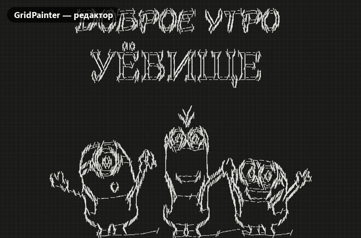
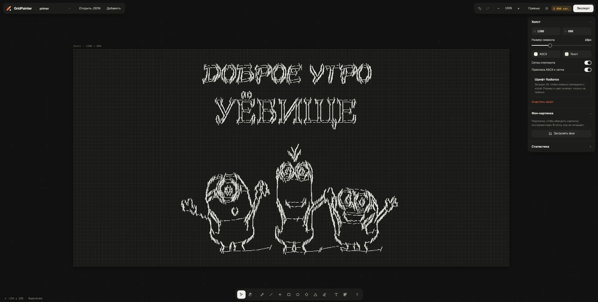
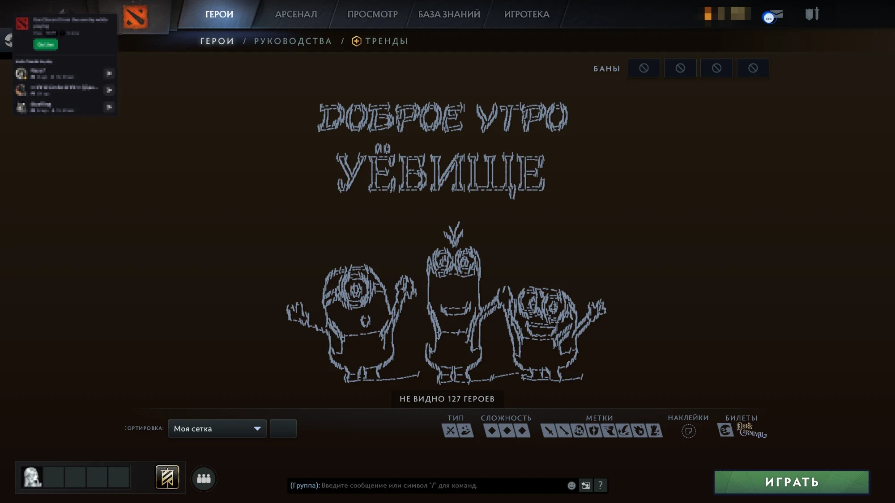

<p align="center">
  
</p>

<h1 align="center">GridPainter</h1>

<p align="center">
  Редактор кастомных сеток героев Dota 2: рисуй ASCII-арт, превращай картинки в line-art<br>
  или мозаику из героев — и получай готовый <code>hero_grid_config.json</code>.
</p>

<p align="center">
  <a href="https://shttps.github.io/setka-dota2-/"><b>▶ Открыть редактор онлайн</b></a>
  &nbsp;·&nbsp;
  Discord: <b>@ahttps</b>
</p>

<p align="center">
  
</p>

## Что это

В Dota 2 в экране выбора героя есть «Сетка героев»: её можно настроить под себя, раскидав героев по категориям. GridPainter использует это как холст. Каждая категория сетки становится «пикселем» рисунка:

- **символом** — пустая категория с названием `.`, `/`, `|` и т. д.;
- **строкой текста**;
- **героем** — портрет подбирается по цвету.

Всё рисуется в браузере, результат экспортируется в файл, который Дота читает как обычную сетку.

| Редактор | В игре |
|:---:|:---:|
|  |  |

## Возможности

**Импорт картинок — три режима, с превью «оригинал / результат»**
- **Line-art.** Контуры через Canny edge detection (как в Photoshop). Символы автоматически ориентируются по углу линии: `- \ | /`. Есть режим «только точки». Настраиваются blur, пороги, яркость, контраст, плотность и лимит категорий.
- **ASCII по яркости.** Наборы символов `.:-=+*#%@`, `░▒▓█`, точки или свой. Есть режим «Брайль строками», очень экономный по количеству категорий.
- **Мозаика из героев.** Каждая клетка — портрет героя, подобранный по среднему цвету. Есть дизеринг, удаление фона и исключение героев из палитры.

**Арт для профиля Steam**
- **Добавить → Арт для профиля Steam…** превращает картинку в Брайль-арт для витрины «Своё информационное поле» (Custom Info Box).
- Ширина по умолчанию — 60 символов, есть счётчик «N / 8000» и кнопка «Влезть в 8000», которая сама подбирает ширину под лимит Steam.
- Пробелы заменяются на пустой символ Брайля, чтобы Steam не съедал отступы. Готовый текст копируется одной кнопкой.

**Pixel ASCII Editor**
- Карандаш, линия, горизонталь/вертикаль, прямоугольник, эллипс, ромб, треугольник (контуром или с заливкой), ластик по области.
- 14 перьев-пресетов и свой символ, настраиваемая плотность сетки.
- Выделение, перетаскивание, группы.
- Действия с группами: масштаб, «Заполнить холст», поворот на 90°, отражения. Символы при повороте тоже меняются: `|` ↔ `-`, `/` ↔ `\`.
- Фон-картинка с приглушением, чтобы обводить.
- Генератор линий, вставка ASCII из буфера и копирование выделения обратно в ASCII.
- Категории героев с выбором героев, текстовые категории.

**Файлы**
- Импорт одного или нескольких `hero_grid_config.json` с выбором сеток.
- Экспорт: арт дописывается к твоим сеткам, остальные не трогаются. В Chrome и Edge файл можно записать прямо на место.
- Загрузка шрифта Radiance (`.ttf`), чтобы превью совпадало с игрой.
- Превью «как в игре», светлая и тёмная тема, отмена/повтор, автосохранение.

## Как пользоваться

1. Открой [редактор онлайн](https://shttps.github.io/setka-dota2-/) или скачай репозиторий и открой `index.html`. Ничего устанавливать не нужно. Chrome или Edge лучше всего: они умеют записывать файл на место.
2. Нажми **Добавить → Картинку** (или просто **Ctrl+V**), выбери режим и подкрути ползунки.
3. Нажми **Открыть JSON** и открой свой файл сетки, чтобы не потерять старые сетки. Он лежит тут:
   ```
   C:\Program Files (x86)\Steam\userdata\<твой ID>\570\remote\cfg\hero_grid_config.json
   ```
4. **Экспорт → Записать в файл** (или «Скачать» и положить файл в эту папку вручную). Перед этим закрой Доту.
5. В игре: вкладка «Герои» → «Сортировка» → выбери свою сетку.

## Горячие клавиши

| Действие | Клавиши |
|---|---|
| Выделение / рука | `V` / `H`, пробел |
| Карандаш, линия, гор./верт. | `P`, `L`, `I` |
| Прямоугольник, эллипс, ромб, треугольник | `R`, `O`, `D`, `Y` |
| Ластик, текст, категория героев | `E`, `T`, `G` |
| Ровные линии / квадрат | `Shift` при рисовании |
| Группировать / разгруппировать | `Ctrl+G` / `Ctrl+Shift+G` |
| Дублировать, копировать, вставить | `Ctrl+D`, `Ctrl+C`, `Ctrl+V` |
| Отменить / повторить | `Ctrl+Z` / `Ctrl+Shift+Z` |
| Превью как в игре, тема | `Tab`, `Shift+T` |
| Вписать холст | `Shift+1` |

## Как это устроено

- **Текст и символы.** Пишутся как категории с `width: 0`, `height: 0` и пустым `hero_ids`: Дота показывает только их название.
- **Мозаика.** Использует то, как Дота раскладывает героев. Карточка героя имеет размер 51×83 плюс 8 отступа, и игра масштабирует карточки так, чтобы все герои влезли в категорию. Поэтому категория размером `(51·c+8)·s × (83·r+8)·s` даёт ровно `c×r` портретов. Картинка режется на полосы, полосы одинаковой ширины склеиваются в одну категорию.
- **Сборки нет.** Чистые HTML/CSS/JS: `app.js` — редактор, `convert.js` — обработка картинок (Canny, дизеринг, подбор цвета в Lab).

## Обновление списка героев

Когда выходит новый герой:

```bash
pip install pillow
python update_heroes.py
```

Скрипт берёт список героев из [OpenDota API](https://docs.opendota.com/), считает средний цвет каждого портрета и перезаписывает `heroes.js`.

## Связаться со мной

Discord: **@ahttps**. Пиши по вопросам, насчёт покупки/заказа сеток и с интересными предложениями.

## Благодарности

- [d2grid](https://github.com/mkk5/d2grid) — размеры карточек из стилей панорамы Доты.
- [DotaHeroGridStudio](https://github.com/T1me1k/DotaHeroGridStudio) — идея текстовых категорий с нулевым размером.
- [OpenDota](https://www.opendota.com/) — данные о героях; портреты — с CDN Valve.

Dota 2 — товарный знак Valve Corporation. Проект не связан с Valve.
